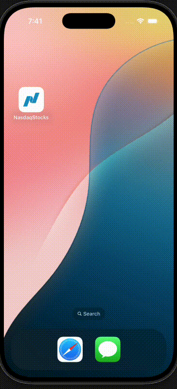
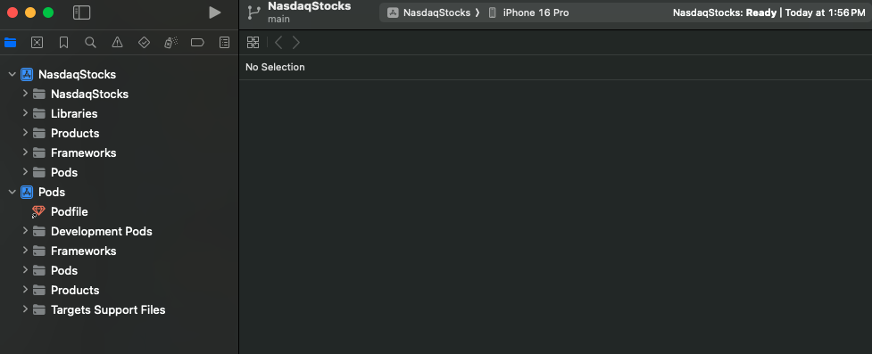

***Disclaimer This is part of Thndr's Hiring Process***

# App Demo

<table>
  <tr>
    <td></td>
    <td></td>
  </tr>
</table>

# Getting Started

> **Note**: Make sure you have completed the [Set Up Your Environment](https://reactnative.dev/docs/set-up-your-environment) guide before proceeding.

## Step 1: Install dependancies

First you will need to install the node modules, use this command:

```
npm install
```

## Step 2: Build the app locally on IOS

Start by installing cocoa pods on your machine if you didnt already.

You can check by running ` pod --version` after you install pod, navigate to your project directory

and type in ` cd ios` so you can cd into the ios folder and then run ` pod install`

Make sure you have xcode and simulator installed on your device, then run this command:

```
npm run-ios
```

This should launch your simulator and the metro server and should start building your app on the simulator.

If you still face trouble with building you can open xcode and build the app from the interface by selecting the ios folder of you project to open then clicking on the PLAY button after choosing a simulator device as shown in the screenshot:



## Step 2.1: Build the app locally on Android

Start by installing android studio and android emualtor if you didnt already.

you can run

```
npm run android
```

It should launch the android emulator and build the app

## Step 3: Setting up ENV vars

Checkout the .env.example file, you should go to polygon.io, obtain an API key and create your own .env file in the root folder
of the project and add it to the file like so:

.env:

```
POLYGON_API_KEY="API Key here"
```

## Step 4: Running the app

After building the app the subsquent runs can be just using this command without having to rebuild the app everytime

```
npm run start
```

## App Overview

### Folder Structure:

```
NasdaqStocks/
├── src/
│   ├── api/
│   │   ├── stocksApi.ts            # handles api request(s) related to stocks
│   │   ├── useInfiniteStocks.tsx   # hook that manages infinite stock data fetching through useInfiniteQuery
│   │
│   ├── assets/
│   │   ├── bootsplash/              # image assets for splash screen
│   │   ├── readme/                  # assets for this readme
│   │   ├── nasdaqlogo.png           # asset image for Header component
│   │
│   │
│   ├── client/
│   │   ├── httpClient.ts            # singleton instance of this app's http client (axios)
│   │   ├── queryClient              # singleton instance of react query client
│   │
│   ├── components/
│   │   ├── __tests__                # Unit tests for the below components
│   │   ├── Header.tsx               # Header component with searchbar
│   │   ├── ListFooter.tsx           # Main list footer with loading spinner
│   │   ├── StockCard.tsx            # Displays stock data in the Main list
│   │
│   ├── constants/
│   │   ├── theme/
│   │   │    ├── index.ts            # constant theme values for react-native-paper provider
│   │   │
│   │   ├── index.ts                 # constant debounce delay for the user search query
│   │
│   ├── hooks/
│   │   ├── useBootSplash.tsx         # hook that hides the splash screen
│   │   ├── useDebounce.tsx           # generic hook that debounces string input by debounceDelay
│   │   ├── useInfiniteStockSearch.tsx  # hook that calls debounce+infinite scrolling and returns the paginated data
│   │
│   ├── screens/
│   │   ├── Explore.tsx     # Main app screen, renders UI components
│   │
│   │
│   ├── App.tsx             # Main App component
│   ├── index.js            # App entry point
│
├── android/                # Android-specific files
├── ios/                    # iOS-specific files
├── node_modules/           # Dependencies
├── package.json            # Project dependencies and scripts
├── package-lock.json       # Locks dependencies to ensure consistent installs across environments
├── tsconfig.json           # TypeScript configuration
├── .eslintrc.js            # Linter configuration
├── .prettierrc             # Prettier configuration
├── README.md               # Documentation
│
├── react-native-config.js  # config for loading font assets for vector icons
│
├── .watchmanconfig  # Configures Watchman to ignore directories for better performance
│
├── babel-config.js  # Configures Babel for RN with presets and plugins.
│
├── .env.example  # example on how to add env variables
│
├── .env  # gitIgnored env file (you should add this yourself following the example)
│
├── jest.config.js  # Sets Jest preset for testing in React Native.
│
├── Gemfile  # Defines Ruby dependencies for React Native iOS builds, ensuring compatibility.
│
├── Gemfile.lock  # Locks Ruby gem dependencies for consistent iOS build environments.


```
