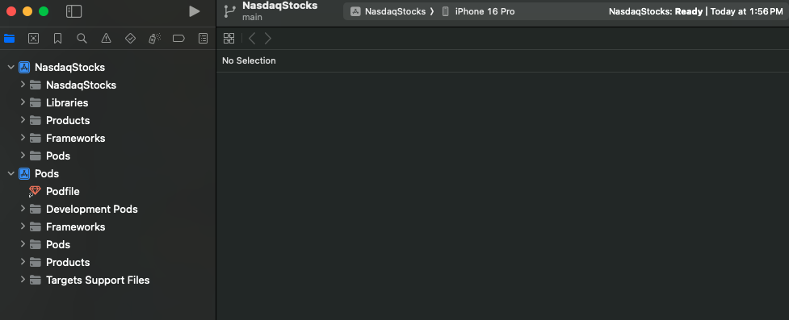

This is a new [**React Native**](https://reactnative.dev) project, bootstrapped using [`@react-native-community/cli`](https://github.com/react-native-community/cli).

# Getting Started

> **Note**: Make sure you have completed the [Set Up Your Environment](https://reactnative.dev/docs/set-up-your-environment) guide before proceeding.


## Step 1: Install dependancies

First you will need to install the node modules, use this command:

```
npm install
```


## Step 2: Build the app locally on IOS

Start by installing cocoa pods on your machine if you didnt already.

You can check by running ``` pod --version``` after you install pod, navigate to your project directory

and type in ``` cd ios``` so you can cd into the ios folder and then run ``` pod install```

Make sure you have xcode and simulator installed on your device, then run this command:
```
npm run-ios
```
This should launch your simulator and the metro server and should start building your app on the simulator.


If you still face trouble with building you can open xcode and build the app from the interface by selecting the ios folder of you project to open then clicking on the PLAY button after choosing a simulator device as shown in the screenshot:




## Step 2.1: Build the app locally on Android

Start by installing android studio and android emualtor if you didnt already.

you can run 
```
npm run android
```
It should launch the android emulator and build the app 


## Step 3: Running the app
After building the app the subsquent runs can be just using this command without having to rebuild the app everytime

```
npm run start
```


## Step 4: Setting up ENV vars

Checkout the .env.example file, you should go to polygon.io, obtain an API key and create your own .env file in the root folder 
of the project and add it to the file like so:

.env:

```
POLYGON_API_KEY="API Key here"
```


